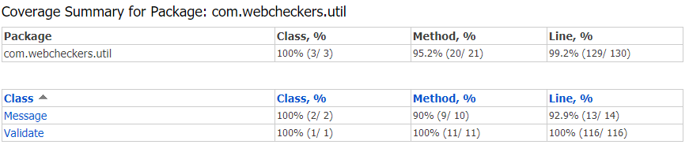

# PROJECT Design Documentation

## Team Information
* Team name: 2C
* Team members: 
  * Julio Cuello 
  * Alanna Luce
  * Benson Yan 
  * Joshua Shaffer
  * Alex Iacob

## Executive Summary

A web checkers application is being created. This implementation contains all of the 
rules and methodology to run a game of checkers.

### Purpose
This is a web checkers application that uses freemarker and Maven
to create a playerLobby, gameCenter and the respective routes to handle
the users signing in, creating games and playing checkers online 

### Glossary and Acronyms

| Term | Definition |
|------|------------|
| VO   | Value Object |
| MVP  | Minimum Viable Product |
| UI | User Interface |

## Requirements

This section describes the features of the application.

### Definition of MVP
The MVP contains all of the basic rules of a classic game of checkers. 
This implies:
* Having a 8x8 checkered board with 12 red and 12 white pieces.
* Being able to capture any piece given there is space.
* Being able to king a checker piece once you get a piece in your opponent's closest row.
* Being able to capture multiple pieces in one single turn with the same checker piece.

### MVP Features
 * Pre-game
   * Create a board
   * Player Sign-in
   * Player Sign-Out
 * Player Movement
   * Single Move
   * Single Jump
   * Multiple Jumps
   * King a Piece
 * End a Game
    * Resign from Game
    * Win a Game

### Road-map of Enhancements
 * Replay feature that allows the user to review past games
 * Spectator feature that allows other to view an ongoing game of checkers

## Application Domain

This section describes the application domain.

The domain shows a checkers game which is played by two players on a 8x8 checkered board. 
Each player has 12 checker pieces; one player has red pieces and the other white. Each piece
is placed on a dark square and can perform a variety of moves. These include, a single move, 
a single jump, and a multi jump. 

## Architecture and Design
This section describes the application architecture.

### Summary
The following Tiers/Layers model shows a high-level view of the webapp's architecture.

As a web application, the user interacts with the system using a
browser.  The client-side of the UI is composed of HTML pages with
some minimal CSS for styling the page.  There is also some JavaScript
that has been provided to the team by the architect.

The server-side tiers include the UI Tier that is composed of UI Controllers and Views.
Controllers are built using the Spark framework and View are built using the FreeMarker 
framework.  The Application and Model tiers are built using plain-old Java objects (POJOs).

Details of the components within these tiers are supplied below.

### Overview of User Interface
This section describes the web interface flow; this is how the user views and interacts
with the WebCheckers application.

When the user is connected to checkers application, user is displayed the 
home page where the number of players online is shown, and a hyperlink to 
get redirect to sign-in page. User will stay on the sign-in page while entering 
an invalid username, otherwise, user is then back to home page. User now is 
able to challenge other players who currently are not in a game. When the user
click on any player who is currently not in a game, both players will be 
redirected to a Board and begin checkers challenge.

### UI Tier
The UI Tier begins with getGameRoute. This route first uses the current and 
opposing users to create an instance of a game using their query parameters.
Next, a template engine is rendered to create the model of the game. After 
the model is rendered and the users are assigned their checker color and 
the game starts. In order for a turn to begin, PostCheckTurnRoute must be run.
This class simply determines when each player's turn is. During a turn, a 
player is able to complete a simple move, single jump, or multi jump. 
These movements are validated in PostValidateMoveRoute. Once the player is 
finished with their valid movement, the turn's validity must be verified.
This is done using PostSubmitTurnRoute. If this route returns invalid, 
then the user is prompted to make a correct move. This cycle is repeated
until a player wins. This data is passed on to BoardView so the users can
see their movements.

#### The WebCheckers In-Game State Diagram

### Application Tier
The Application Tier begins with an instance of class PlayerLobby. This contains 
the information to begin a game. To start, PlayerLobby makes a list to place all 
active members in. Each time a player signs in with a verified username, they are
added to that list and can begin playing. Afterwards, an instance of GameCenter is
created. This allows for users to play a game with each other. A new game is created
using the two players and then a board is created. 

#### The WebCheckers Log-in Diagram

### Model Tier
The Model Tier begins with an instance of Board. This board contains eight 
instances of class Row. Each instance of the class Row contains eight separate
instances of class Space, which can either be a white or black SpaceColor. Once
a game begins, 12 red and 12 white checker pieces are added to their respective
black spaces. Each of these placed pieces is an instance of Piece that contains
a Position, PieceColor, and PieceType. After each turn is submit, the Board updates
using BoardView.

### Design Improvements
Some of the design improvements that can be made include
* Lower Coupling
* Higher Cohesion
From Sprint 1, the feedback received allowed a variety of classes to be less
reliant on each other and that the code had a case of session-abuse. This was
then fixed in the newer implementation of getGameRoute. Now instead of having
session-abuse, the necessary information is taken from the Player. 

## Testing
The testing that was performed was created using Mockito. Mock classes were made
to simulate the code actually running and seeing if we get the desired outputs. 
Some classes only had to test whether their getters were getting the correct 
information while other classes had more complicated methods to test. One major 
issue that was resolved via testing was a method in Validate.java, where a method
was returning the same value regardless of what its arguments were. This allowed
us to resolve that issue and carry on.

### Acceptance Testing
The acceptance criteria for each of the user stories have been fully completed.

### Unit Testing and Code Coverage
The unit testing strategy for this sprint was to get as high coverage percentage
as possible. Every class that was actively used has become a friendly class, with
a complete coverage of the code. 

### Coverage Tests

